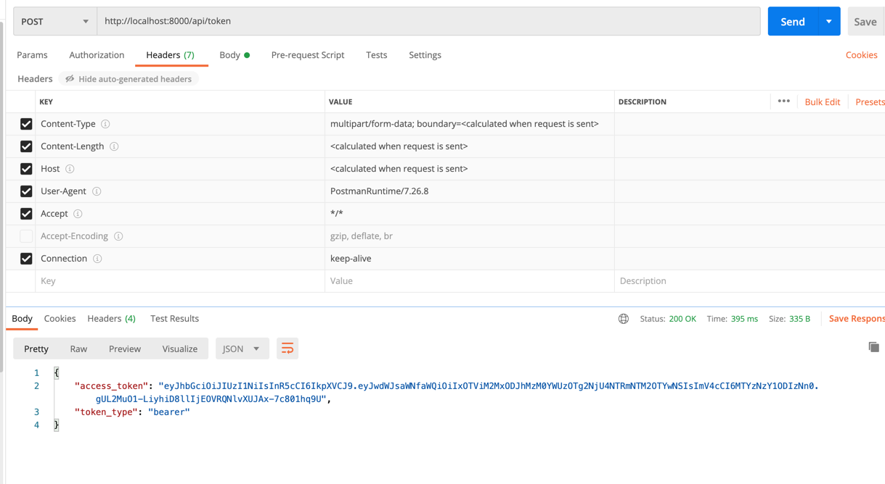
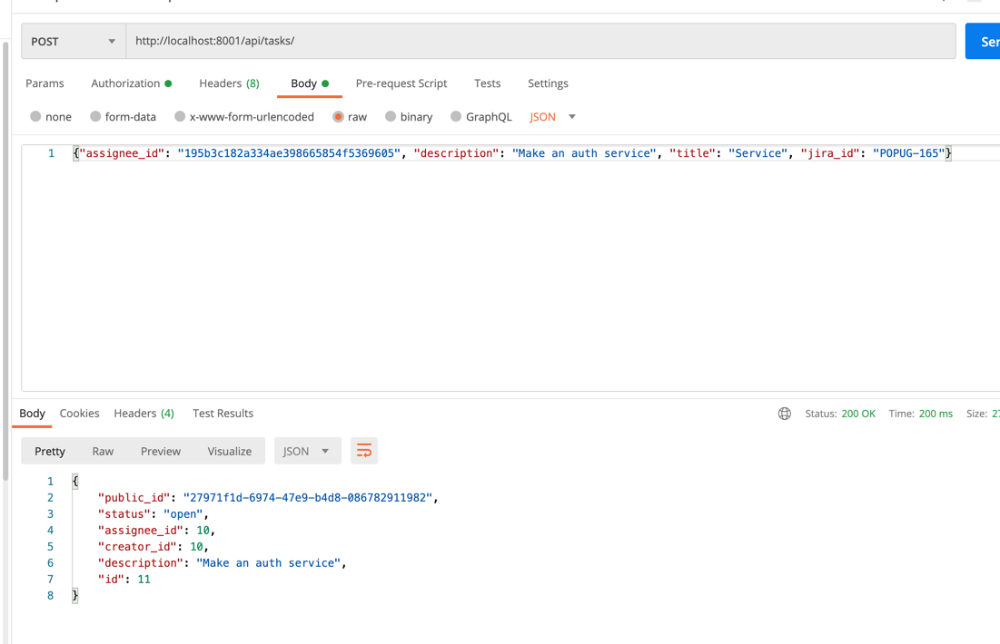
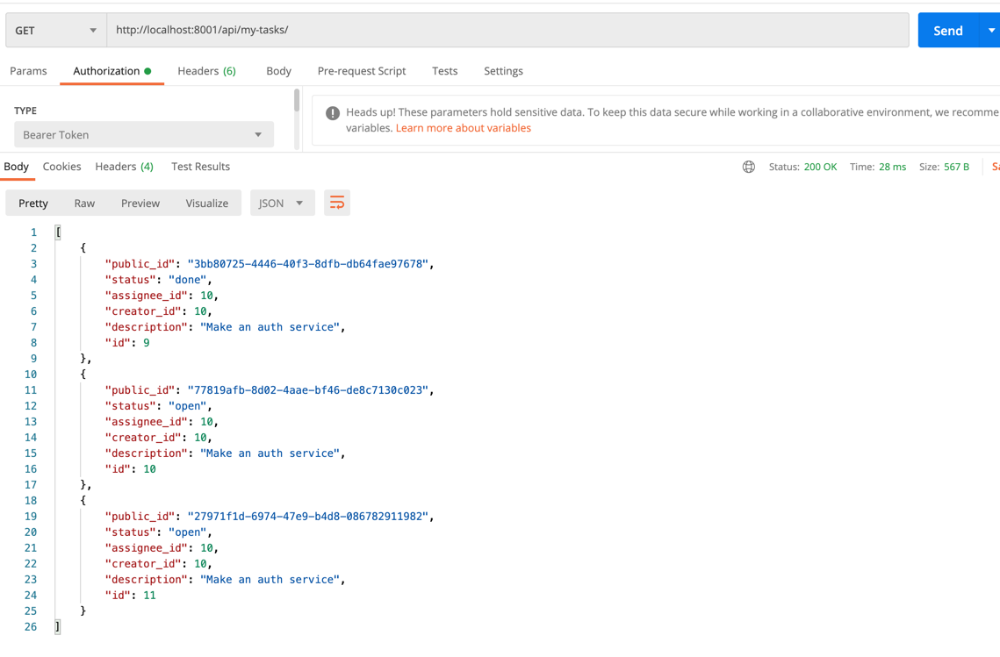
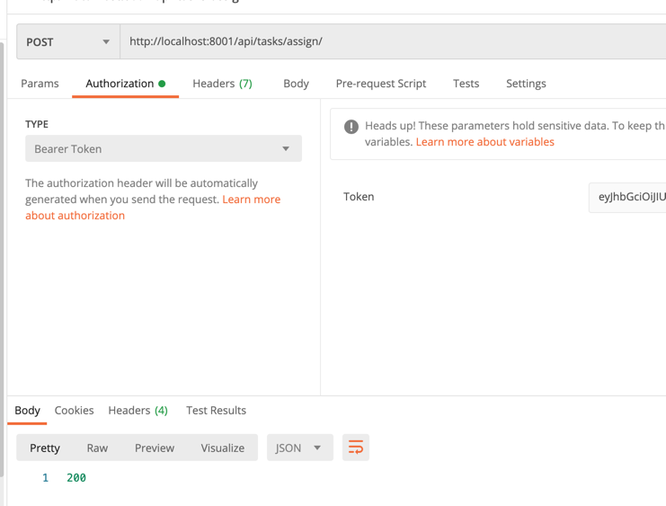
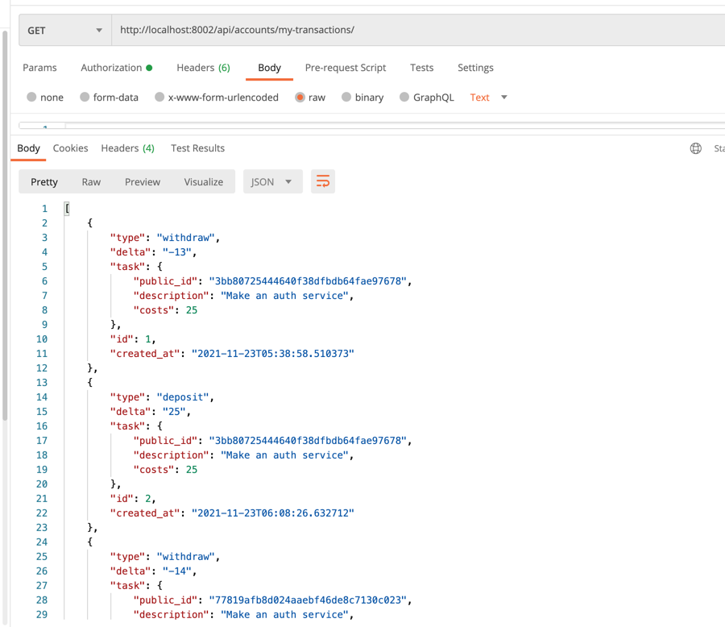
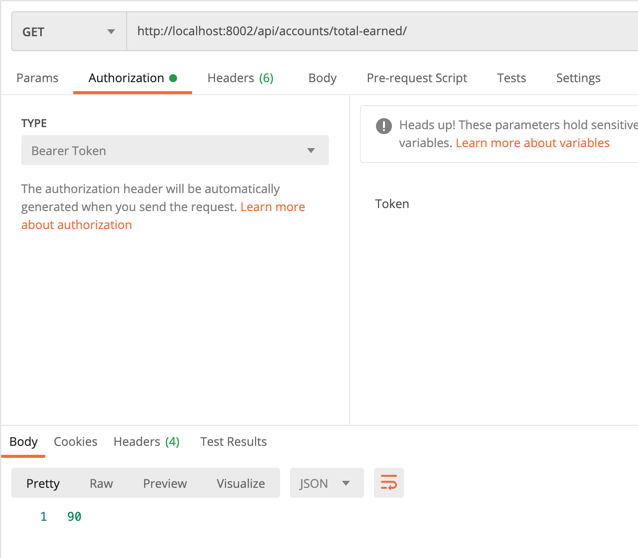
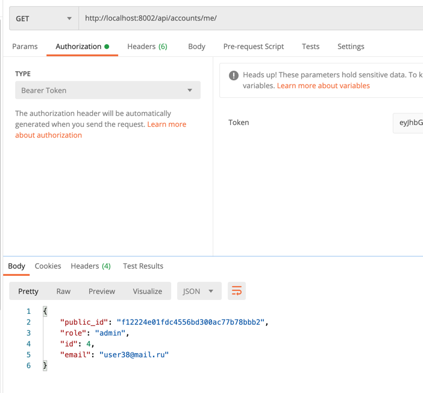
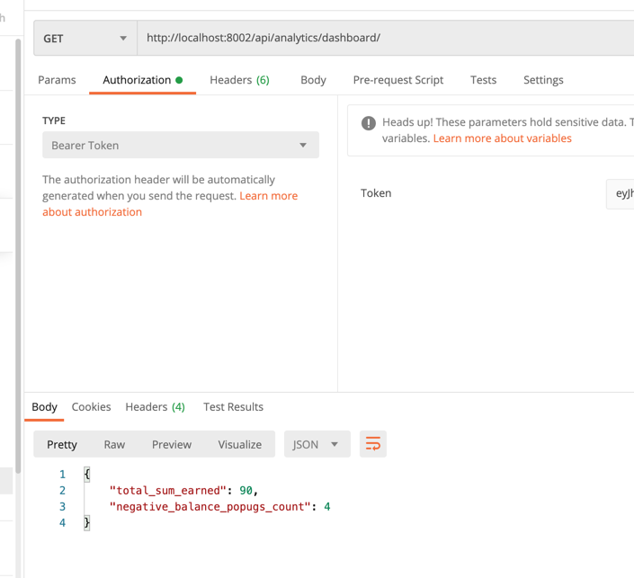
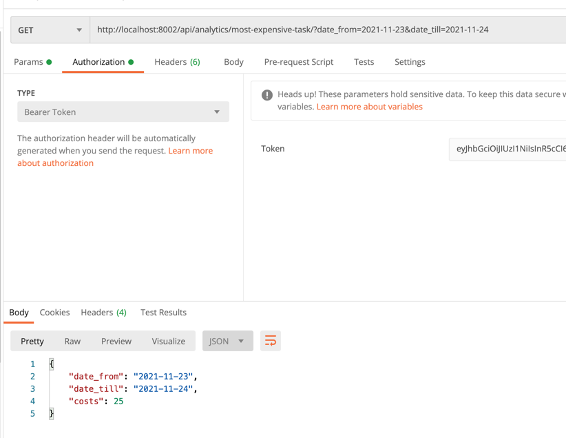

# async_arch_course

Задания к курсу по асинхронной архитектуре https://education.borshev.com/architecture

cd final_project

поднимаем кафку
docker-compose up -d

поднимаем сервис аутентификации:
- cd auth
- база в докере: docker-compose -f docker-compose.local.yml up  -d
- poetry install
- cp settings/.env.template settings/.env
- приложение: ENV_FILE=settings/.env poetry run python main.py

поднимаем сервис тасков:
- cd ../task_manager
- база в докере: docker-compose -f docker-compose.local.yml up
- poetry install
- cp settings/.env.template settings/.env
- приложение: ENV_FILE=settings/.env poetry run python main.py
- консьюмер евентов: ENV_FILE=settings/.env poetry run python event_consumer_main.py

поднимаем сервис биллинга/аналитики:
- cd ../accounting
- база в докере: docker-compose -f docker-compose.local.yml up  
- poetry install
- cp settings/.env.template settings/.env
- приложение: ENV_FILE=settings/.env poetry run python main.py
- консьюмер евентов: ENV_FILE=settings/.env poetry run python event_consumer_main.py

